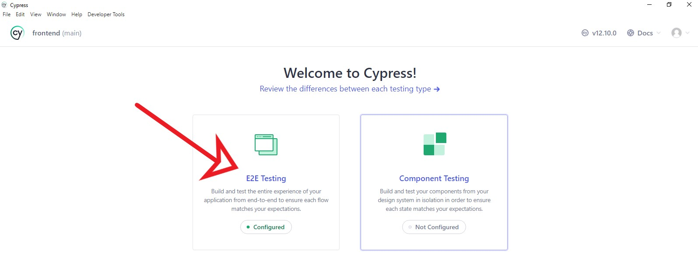
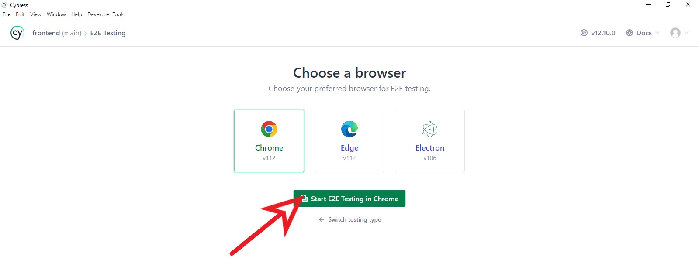
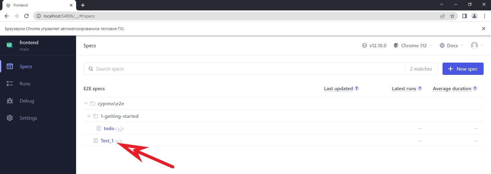
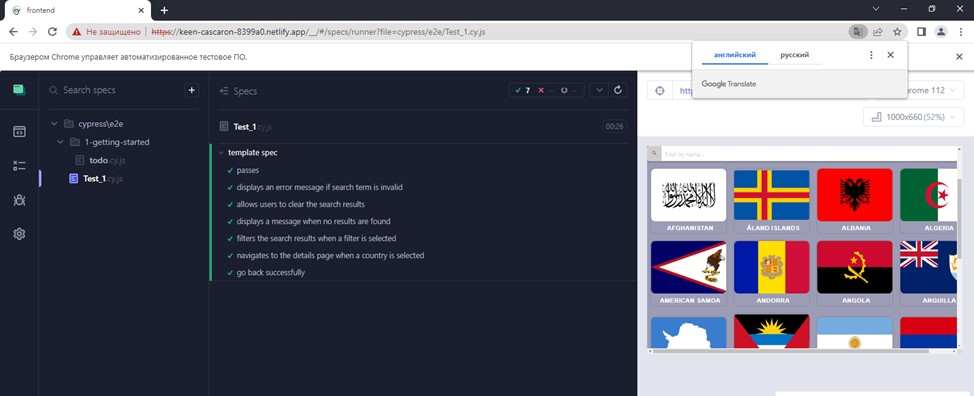

# Backend

1. This backend has deployed in [Render](https://render.com).
2. Work link is `https://bounse-insights-countries-test.onrender.com`.
3. At the first start, you may need to wait 2-5 minutes. Due to the fact that the hosting `Renderer` is free, it goes into sleep mode, when sending a request to the server, it needs time to wake up.

# Frontend

1. This frontend has deployed in [Netlify](https://app.netlify.com).
2. Live page is [https://keen-cascaron-8399a0.netlify.app](https://keen-cascaron-8399a0.netlify.app).

## React template

This project was created with
[Create React App](https://github.com/facebook/create-react-app). To get
acquainted and configure additional features
[refer to documentation](https://facebook.github.io/create-react-app/docs/getting-started).

## Deploy

The production version of the project will automatically be linted, built, and
deployed to GitHub Pages, in the `gh-pages` branch, every time the `main` branch
is updated. 

### Deployment status

The deployment status of the latest commit is displayed with an icon next to its
ID.

- **Yellow color** - the project is being built and deployed.
- **Green color** - deployment completed successfully.
- **Red color** - an error occurred during linting, build or deployment.

More detailed information about the status can be viewed by clicking on the
icon, and in the drop-down window, follow the link `Details`.

### Live page

After some time, usually a couple of minutes, the live page can be viewed at the
address specified in the edited `homepage` property. For example, here is a link
to a live version for this repository
[https://keen-cascaron-8399a0.netlify.app](https://keen-cascaron-8399a0.netlify.app).

If a blank page opens, make sure there are no errors in the `Console` tab
related to incorrect paths to the CSS and JS files of the project (**404**).

## How it works

1. After each push to the `main` branch of the GitHub repository, a special
   script (GitHub Action) is launched from the `.github/workflows/deploy.yml`
   file.
2. All repository files are copied to the server, where the project is
   initialized and linted and built before deployment.
3. If all steps are successful, the built production version of the project
   files is sent to the `gh-pages` branch. Otherwise, the script execution log
   will indicate what the problem is.

# Testing of application by Cypress

1. Register, download and install [Cypress app](https://docs.cypress.io/guides/getting-started/installing-cypress) in your PC.
2. Follow to your project: `cd /your/project/path`.
3. Instal `npm i cypress`.
4. Open `Cypress app` with use command `npx cypress open`.
5. Wheh `Cypress app` have opened, click plese on these bottons:

6. Use file `Test_1.cy.js`  for testing: 

7. Result (I hope;-) will be successfull:

